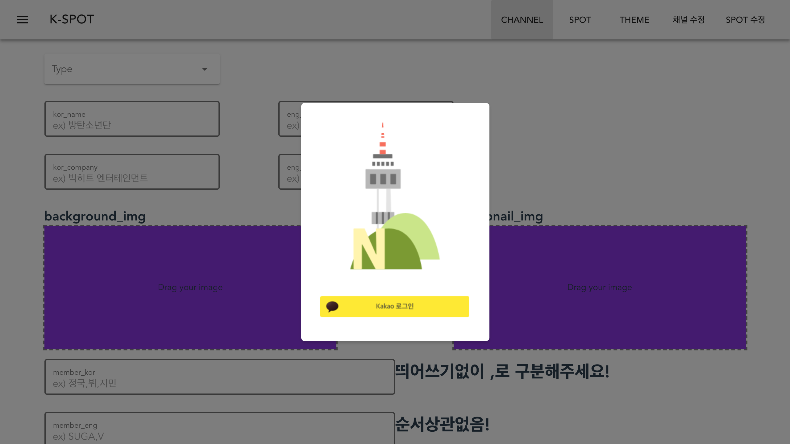

# K-Spot 관리자 페이지
> Seoul App Contest Project

K-Spot은 국내외 한류팬들을 위한 한류 관광 정보 제공 서비스이다. K-Spot 관리자 페이지는 K-Spot 서비스에 컨텐츠를 등록하고 관리하기 위해 개발하였다.

<http://kspotadmin.s3-website.ap-northeast-2.amazonaws.com/>


## 페이지 구성

### CHANNEL
* K-Spot의 채널을 등록할 수 있는 페이지이다.

### SPOT
* K-Spot의 SPOT(장소/이벤트)을 등록할 수 있는 페이지이다.

### THEME
* K-Spot의 테마를 등록할 수 있는 페이지이다.

### 채널 수정
* K-Spot의 채널을 수정하거나 삭제할 수 있다.

### SPOT 수정
* K-Spot의 SPOT(장소/이벤트)을 수정하거나 삭제할 수 있다.


## Development Environment
* npm - **v 6.4.1**
* vue - **v 2.5.17**


## Build Setup

``` bash
# install dependencies
npm install

# serve with hot reload at localhost:8080
npm run dev

# build for production with minification
npm run build

# build for production and view the bundle analyzer report
npm run build --report
```

For a detailed explanation on how things work, check out the [guide](http://vuejs-templates.github.io/webpack/) and [docs for vue-loader](http://vuejs.github.io/vue-loader).


## Tech/framework
- [vuex](https://vuex.vuejs.org/kr/) : 컴포넌트 간의 통신을 쉽게 하기 위해 활용
- [axios](https://www.npmjs.com/package/vue-axios) : 서버와의 원활한 통신을 위해 활용
- [vuetify](https://vuetifyjs.com/ko/) : 반응형 웹사이트 제작을 위해 활용
- [vuex-persistedstate](https://www.npmjs.com/package/vuex-persistedstate) : cookie를 통해 기본 정보를 저장하기 위해 활용
- [js-cookie](https://github.com/js-cookie/js-cookie) : cookie를 통해 기본 정보를 저장하기 위해 활용

## Web Homepage

